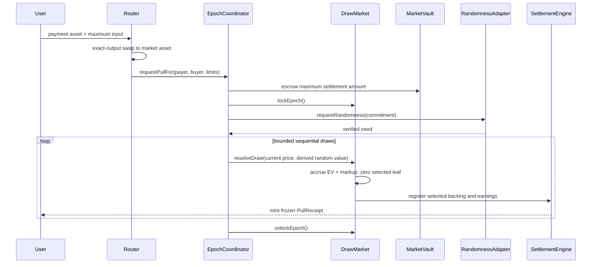

# Contract architecture

The contracts implement the solvency-critical core from `SPECS.md`. Each market has exactly one ERC-20 settlement asset. Native ETH is wrapped before market entry, so ETH and USDG never share a probability tree or liability ledger.

OpenZeppelin Contracts is pinned to the audited `v5.7.0` release. Market instances are fixed EIP-1167 clones of a registry-approved implementation. A clone cannot change its implementation address.

## Ownership boundaries

| Contract            | Source of truth                                                                           |
| ------------------- | ----------------------------------------------------------------------------------------- |
| `ProtocolRegistry`  | Approved assets, adapters, routers, implementation code hashes, and market creators       |
| `MarketFactory`     | Market IDs and fixed-version market deployments                                           |
| `DrawMarket`        | Positions, backing, weighted tree, per-position accumulators, Crown, deposit state        |
| `EpochCoordinator`  | Pull escrow, price limits, epoch lock, randomness request, bounded resolution and refunds |
| `SettlementEngine`  | Selected backing, pull receipts, decision state, payout claims, settlement fee waterfall  |
| `MarketVault`       | Isolated custody for one market’s NFT inventory and settlement asset                      |
| `PositionNFT`       | Transferable ownership of an active or staged position                                    |
| `PullReceipt`       | Frozen revealed settlement right and historical proof after settlement                    |
| `RewardController`  | Protected `$DRAW` purchases and per-user queued reward input                              |
| `ReferralRegistry`  | Permanent wallet attribution and registered referral codes                                |
| `SwapAndPullRouter` | Exact-output payment conversion, native ETH wrapping, payout conversion and refunds       |

## Pull flow



Each draw recalculates `N`, total inverse-backing weight, expected value, and price after the previous selected leaf has been removed.

`requestPullFor` can debit only the calling router, and that router must still be approved in `ProtocolRegistry` at call time. Registry deapproval therefore takes effect immediately even if the coordinator role has not yet been revoked.

A randomness adapter revert, malformed response, zero request ID or request ID reused by the same adapter leaves the epoch in the observable `RandomnessRequested` state and emits `RandomnessRequestFailed`. Anyone can cancel and refund that epoch after `randomnessTimeout`. Each adapter's request IDs are permanently fenced to their originating epoch so a stale request cannot fulfill a later one.

Each `resolveEpoch` budget unit covers one encountered queue entry or draw attempt, including completed, expired, ineligible and over-price orders. Receiver eligibility is evaluated with the market policy's `canReceive(receiver, selectedPositionId)` rule before selection; an ineligible order is refunded without resampling or removing the position.

## Liability conservation

`DrawMarket.totalLiabilities()` includes its own liabilities plus those owned by its `EpochCoordinator` and `SettlementEngine`.

```text
vault balance >=
    position backing
  + pull escrow and refunds
  + active-position cash earnings
  + reward purchase input
  + selected backing and settlement earnings
  + Crown and user claims
  + referral, insurance, buyback and treasury revenue
```

Fee-on-transfer settlement assets are rejected through exact balance-delta checks. Selection zeroes the weighted-tree leaf and freezes the `PositionNFT`; settlement burns it before releasing funds or the underlying NFT. The frozen pull receipt remains as the historical settlement proof.

Revealed settlement first converts cash payouts into owner-bound claims held by the `SettlementEngine`. A rejecting or denylisted payout recipient therefore cannot block settlement or `forceKeep`; only the claim owner can retry delivery or redirect it to another receiver. `$DRAW` settlement is different: the receipt owner supplies `minDrawOut` and route data, and the `RewardController` performs the protected swap atomically. If that swap fails, the receipt and all selected-position liabilities remain unconsumed so the owner can retry or select cash.

## Administration

- Deploy `ProtocolRegistry` with a timelock as its admin in production.
- The guardian can pause only new deposits or new pulls, through separate market and coordinator controls.
- Withdrawals, refunds, revealed settlements and `forceKeep` have no pause path.
- Randomness and eligibility modules can change only while no epoch is in flight and must remain registry-approved.
- Vault operators are set once to the market, epoch coordinator and settlement engine.

## Deployment order

1. Deploy the timelock/governor, `$DRAW`, registry, referral registry, reward controller, WETH-aware router and adapter contracts.
2. Deploy one `DrawMarket` implementation and the four small component deployers.
3. Deploy `MarketFactory` with those fixed addresses.
4. Register the implementation runtime code hash and approve settlement assets/modules/router.
5. Grant the factory registry-manager and factory roles on the referral and reward controllers.
6. Create markets through `MarketFactory.createMarket`.

## Production integration gates

The repository intentionally does not pretend local mocks are production infrastructure. Mainnet deployment still requires:

- a Robinhood Chain audited randomness adapter satisfying withholding and timeout requirements;
- an audited Uniswap v4 `ISwapAdapter` with Permit2, exact-output routing and price-impact protection;
- canonical Robinhood Chain WETH and USDG addresses;
- a timelock/governance deployment and role handoff;
- external audit, invariant campaign and chain-specific finality testing;
- collection-specific custody/valuation adapters for physical assets.
