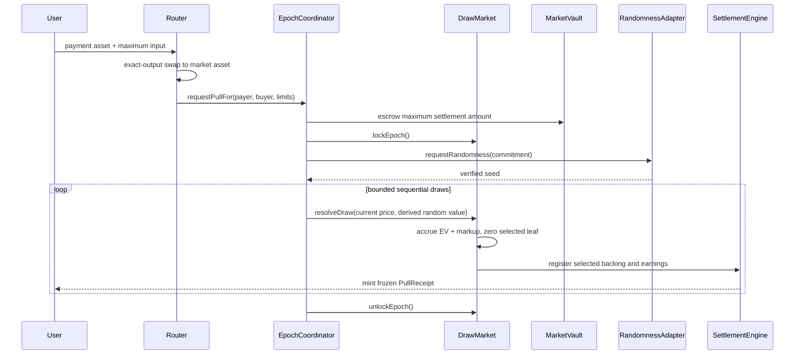

# Contract architecture

The contracts protect market solvency and settlement. Each market uses one ERC-20 settlement asset.

The router wraps native ETH before it enters a market. ETH and USDG never share a probability tree or liability ledger.

The protocol pins OpenZeppelin Contracts to version 5.7.0. Each market is a fixed EIP-1167 clone of a registry-approved implementation. A clone cannot change its implementation address.

## Contract ownership

| Contract            | Owns                                                                               |
| ------------------- | ---------------------------------------------------------------------------------- |
| `ProtocolRegistry`  | approved assets, adapters, routers, implementation code hashes and market creators |
| `MarketFactory`     | market IDs and fixed-version market deployments                                    |
| `DrawMarket`        | positions, backing, weighted tree, accumulators, Crown and deposit state           |
| `EpochCoordinator`  | pull escrow, price limits, epoch lock, randomness, bounded resolution and refunds  |
| `SettlementEngine`  | selected backing, pull receipts, decisions, payout claims and settlement revenue   |
| `MarketVault`       | isolated NFT and settlement-asset custody for one market                           |
| `PositionNFT`       | transferable ownership of an active or staged position                             |
| `PullReceipt`       | revealed settlement rights and the historical proof                                |
| `RewardController`  | protected `$DRAW` purchases and queued reward input for each user                  |
| `ReferralRegistry`  | permanent wallet attribution and registered referral codes                         |
| `SwapAndPullRouter` | payment conversion, native ETH wrapping, payout conversion and refunds             |

## Fixed market economics

`ProtocolTypes.MarketConfig` contains `markupBps`, `cashPayoutBps` and `keepPayoutBps`.

The market stores the markup. Its `SettlementEngine` stores both payout ratios. Governance cannot change these values after users enter the market.

`MarketFactory.createMarket` checks these version 1 limits before it deploys a component:

```text
markupBps <= 5,000
8,000 <= cashPayoutBps <= 9,500
9,500 <= keepPayoutBps <= 10,000
cashPayoutBps <= keepPayoutBps
```

These limits reduce deployment risk. They do not show that a policy will attract demand or make a profit.

The flagship target is `250 / 9,000 / 9,900`. This means a 2.5% markup, a 90% cash or `$DRAW` input ratio, and a 99% keep ratio.

Its cash-floor return to player is `9,000 / 10,250 = 87.8%`. This figure excludes gas, swaps and payment routing. It also excludes collectible value, `$DRAW` value and entertainment value.

## Pull flow



The market recalculates the position count, inverse-backing weight, expected value and price after each selection.

`requestPullFor` can debit only the calling router. The registry must still approve that router at call time. Removing registry approval therefore takes effect at once.

The epoch records a failed randomness request when an adapter:

- reverts
- returns malformed data
- returns a zero request ID
- reuses one of its request IDs

The epoch stays in `RandomnessRequested`. Anyone can cancel it after `randomnessTimeout` and refund each unresolved order once. A stale request ID cannot fulfil a later epoch.

Each `resolveEpoch` budget unit covers one queue entry or draw attempt. This includes expired, ineligible and over-price orders.

The market checks `canReceive(receiver, selectedPositionId)` before selection. It treats a denial, revert or malformed response as ineligible. The coordinator refunds that order without selecting another position for it.

Anyone can cancel an epoch after the timeout only if it has no accepted seed. Once accepted, the seed remains binding. Resolution can continue after the request timeout.

An unexpected `resolveDraw` revert restores that attempt's escrow debit. It moves the epoch to `Refunding` before returning control.

Later cancellation calls process no more than the supplied order budget. Resolution cannot resume from `Refunding`. Earlier selections remain valid, and each unresolved suffix receives one refund.

The coordinator gives `resolveDraw` a fixed 2,000,000 gas. It also requires 300,000 gas for recovery before it debits escrow. A caller cannot force recovery by supplying less gas.

## Liability conservation

`DrawMarket.totalLiabilities()` includes liabilities held by the market, coordinator and settlement engine.

```text
vault balance >=
    position backing
  + pull escrow and refunds
  + active-position cash earnings
  + reward purchase input
  + selected backing and settlement earnings
  + Crown and user claims
  + referral, insurance, buyback and treasury revenue
```

The protocol rejects fee-on-transfer and rebasing settlement assets. Exact balance checks protect every deposit and release. A failed check reverts the transfer and liability update together.

The Crown takeover threshold is 110% of the incumbent's backing. The market recalculates succession when the incumbent reduces its backing.

The active position with the highest backing wins. The lower tree slot breaks a tie. Selected, staged and removed positions cannot become the Crown.

Selection removes the weighted-tree leaf and freezes the `PositionNFT`. Settlement burns that token before it releases funds or the NFT. The pull receipt remains as proof.

The settlement engine turns revealed cash payouts into owner-bound claims. A blocked recipient cannot stop settlement or `forceKeep`. The claim owner can retry or choose another receiver.

Market withdrawals apply the same rule to backing, earnings and NFT delivery. A failed transfer becomes an owner-bound claim. It does not change who owns another person's earnings.

The `RewardController` normally receives reward input for a later protected `$DRAW` purchase. If that transfer fails during an exit, the owner receives a backed settlement-asset claim instead. `RewardFundingCashFallbackAccrued` records this final choice.

A `$DRAW` settlement follows a different rule. The receipt owner provides `minDrawOut` and route data. A failed swap leaves the receipt and its liabilities unchanged, so the owner can retry or choose cash.

Each successful reward swap must spend the exact input amount. The remaining input balance must still cover `totalQueued`. A partial pull, transfer tax or adverse rebase reverts the whole swap.

## Administration rules

Production administration must follow these rules:

- use a timelock as the `ProtocolRegistry` administrator
- let the guardian pause only new deposits or pulls
- keep withdrawals, refunds, revealed settlements and `forceKeep` available
- change randomness or eligibility modules only when no epoch is active
- require the registry to approve each replacement module
- set vault operators once for the market, coordinator and settlement engine

## Deployment order

1. Deploy the timelock, `$DRAW`, registry, referral registry, reward controller, router and adapters.
2. Deploy one `DrawMarket` implementation and the 4 component deployers.
3. Deploy `MarketFactory` with those fixed addresses.
4. Register the implementation code hash and approve the assets, modules and router.
5. Grant the factory the required registry, referral and reward roles.
6. Create each market through `MarketFactory.createMarket`.
7. Use `250 / 9,000 / 9,900` for the flagship market.

## Complete the production requirements

Do not treat the local mocks as production infrastructure. A paid launch still needs:

- an audited Robinhood Chain randomness adapter with withholding and timeout controls
- an audited Uniswap v4 adapter with Permit2, exact-output routing and price protection
- canonical Robinhood Chain WETH and USDG addresses
- a timelock deployment and role handover
- an external audit, invariant campaign and chain finality tests
- collection-specific custody and valuation adapters for physical assets
- pre-pull disclosure of the fixed ratios, cash-floor return, uncertainty and excluded costs
- a production indexer for settlement choices, repeat use, concentration and realised return
- a public comparison of modelled and observed results
- launch review periods and thresholds set before paid use

The current frontend adapter contains mock data. Use it for interaction testing only. It does not meet the launch evidence requirement.

External comparisons may inform scenario tests. They do not prove that one ratio causes demand, retention or profit.
